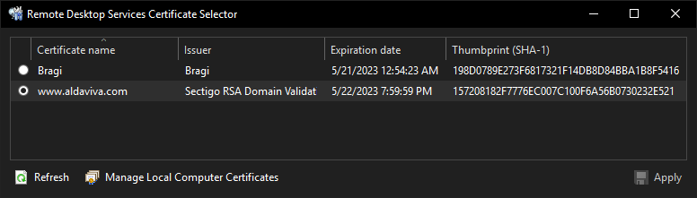

 Remote Desktop Services Certificate Selector
===

[](https://github.com/Aldaviva/RemoteDesktopServicesCertificateSelector/actions/workflows/dotnetframework.yml)

This GUI program lets you choose the certificate to encrypt your Remote Desktop Services connections.

In Windows Server 2008 R2 and earlier, this functionality was available in the Remote Desktop Session Host Configuration (`tsconfig.msc`), but Microsoft removed it from Windows Server 2012 and later, which means you can only [configure it programmatically using WMI](https://serverfault.com/a/444287/227008).

Thanks to [major web browser vendors needlessly bullying certificate authorities into restricting the maximum validity duration of a certificate to roughly 1 year](https://www.ssls.com/blog/apples-new-ssl-lifetime-limitation-and-what-it-means-for-you/), I now have to deal with this problem far more often than if I could just buy a 5-year cert, install it once, and then not think about it for a long time. This change makes no sense: my owner checks are simply using domain validation, which is just a simple proof of DNS control and does not guarantee much of anything; key rotation is not more frequent because you are not required to generate a new private key or CSR, just a public cert; and all of the improvements over time in public key cryptography come from the protocols which use the certificates, not the certs themselves, such as Apache httpd and Nginx implementing HTTP/2 and TLSv1.3.



<!-- MarkdownTOC autolink="true" bracket="round" autoanchor="false" levels="1,2,3" style="ordered" -->

1. [Requirements](#requirements)
1. [Installation](#installation)
1. [Certificate Conversion](#certificate-conversion)
1. [Usage](#usage)
1. [Validation](#validation)

<!-- /MarkdownTOC -->

## Requirements

- Windows (tested on Server 2019)
- [.NET Framework 4.8](https://dotnet.microsoft.com/download/dotnet-framework) or later

## Installation

1. Download the [latest EXE](https://github.com/Aldaviva/RemoteDesktopServicesCertificateSelector/releases/latest/download/RemoteDesktopServicesCertificateSelector.exe) file from [Releases](https://github.com/Aldaviva/RemoteDesktopServicesCertificateSelector/releases/latest).

It's a portable application. You can save it, run it, and then delete it when you're done. It won't leave any files or registry values behind.

## Certificate Conversion
Both your public certificate and private key are required for servers like Remote Desktop Services. These must be imported into a Windows certificate store using [PKCS #12](https://wikipedia.org/wiki/PKCS_12) format, which uses the P12 and PFX file extensions. If you don't convert to PKCS #12, the private key can't be imported, and you won't be able to encrypt traffic on your server.

If you have a certificate that you want to import, like a PEM or DER encoded keypair, you will first need to temporarily convert it to PKCS #12:

```sh
openssl pkcs12 -in "mypubliccert.pem.crt" -inkey "myprivatekey.pem.key" -out "mycertandkey.pfx" -export
```

This PFX file is the one to import into Windows, not the CRT file. Be aware that the Certificate Import Wizard defaults to only showing .CER and .CRT files, so it's easy to accidentally import only the public key and therefore be unable to use it for your server. Be sure to change the file type dropdown in the Open dialog box to Personal Information Exchange so that your PFX file is shown.

After importing the PFX file, you can delete it from disk.

## Usage

1. Run `RemoteDesktopServicesCertificateSelector.exe`.
1. If you haven't already done so, install your new certificate into Certificates (Local Computer) › Personal › Certificates.
    - You can open this certificate store by clicking ** Manage Local Computer Certificates**.
    - Once it's installed, click ** Refresh** in this program to show the newly-installed certificate.
1. Click the radio button for the certificate you want to use on your RDP connections.
1. Click ** Apply**.

New connections to your `RDP-tcp` listener will now use the new certificate. This change takes effect immediately for all new connections; you don't need to restart any services or your computer.

You can view a certificate or copy its SHA-1 thumbprint by right-clicking on a row.

## Validation

To test the new certificate, you can reconnect using `mstsc.exe`. Next, click the 🔒 button in the fullscreen toolbar, then click View Certificate.

You can also test the certificate with `openssl`:
```sh
echo | openssl s_client -connect myserver.com:3389 2>/dev/null | openssl x509 -noout -text
```
